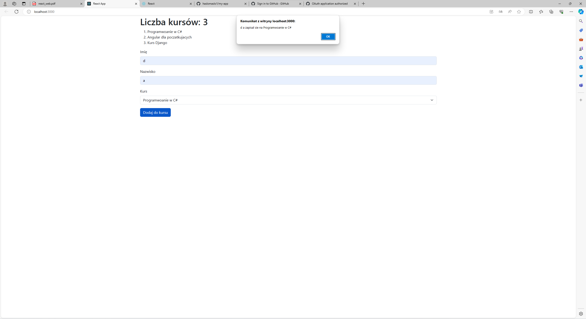
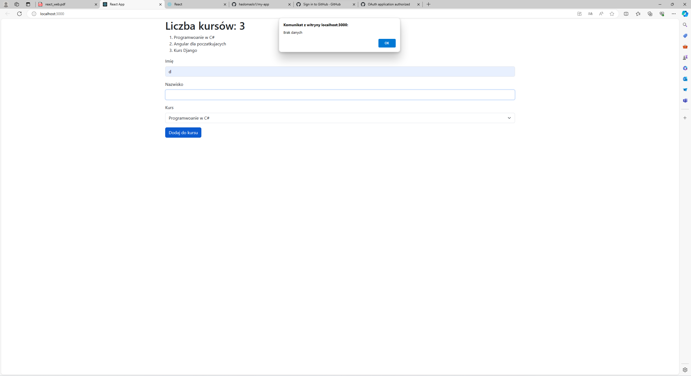

## Zapis na kursy
Prosta aplikacja umozliwiajaca zapisy na kursy, wykorzystujaca Bootstrap do formularza.

## Wprowadzenie
Aplikacja wyswietla liste kursow oraz formularz do zapisow. korszystajacy podaje swoje imie, nazwisko i wybiera kurs, na ktory chce się zapisac.

## Czego uzylem
React, Bootstrap

## Opis komponentu
Klasa KursyForm zarzadza formularzem zapisu i wyswietla liste kursów.

imie: imie uzytkownika
nazwisko: nazwisko uzytkownika
wybranyKurs: wybrany kurs
Funkcja handleSubmit sprawdza, czy wszystkie pola są wypelnione, i wyswietla odpowiedni komunikat.

